[← Niaga Labs](https://github.com/niaga-labs) · the full architecture of **Niaga**, our e-commerce platform

<div align="center">

# Niaga

**E-commerce platform behind a factory-direct dropship store**

*Ten Go services, three Next.js apps and one Postgres database. Built solo, 2023-2026.*

[]()
[]()
[]()
[]()
[]()
[]()
[]()
[]()

**Designed, built, and maintained entirely by a solo developer**

</div>

---

## Developer

| | |
|---|---|
| **Name** | **Muhammad Luqman** |
| **Role** | Solo Full-Stack Developer & System Architect |
| **Scope** | Architecture design, backend & frontend development, database design, external API integration, DevOps & deployment, infrastructure management |
| **Location** | Terengganu, Malaysia |

> This entire platform — from designing the microservices architecture, developing 10 backend services in Go, 3 frontend apps in Next.js/TypeScript, designing 17 database schemas with 132 tables, integrating Shopee, TikTok & Parcel Daily APIs, implementing enterprise patterns (Saga, Circuit Breaker, Event Sourcing), to running 21 Docker containers on a production VPS — was built entirely solo by a single developer.

---

## Status — as of 2026

| | |
|---|---|
| **Built** | 2023–2026, as *Desa Murni Batik*, for a batik factory in Terengganu. Renamed **Niaga** in 2026 when the product became a general e-commerce platform |
| **Ran in production** | On a single VPS, serving the factory's retail and marketplace operations |
| **Today** | The production VPS is **retired**. The platform is no longer serving live traffic |
| **The code** | Actively maintained. Runs end to end on a local development stack — schema loaded, services from source, storefront and admin against them |
| **What is current** | The database definition (17 schemas, 132 tables, 3 views, 73 foreign keys), all 10 services, 3 frontends and the shared libraries |
| **What is archived** | The VPS deployment scripts, backup cron and TLS setup in `infra-platform`, kept for reference |

Everything below describes the system as designed and built. Where it says a service *does* something, that is
what the code does — verified by running it, not by memory of the production deployment.

### What is **not** built

Older versions of this page implied more than the code supports. For the record:

| Claim you might expect | Reality |
|---|---|
| Wholesale / tiered pricing | **Not built.** A couple of frontend pages mention it; there is no backend for it |
| Multi-branch / multi-outlet | **Not built.** Stock is per warehouse, and phase 1 runs a single warehouse |
| Push notifications | **Not built.** `service-notification` is a JetStream consumer with no HTTP API |
| SMS | **Stub by default.** The Twilio path exists but ships disabled |
| Warehouse picking app | **A mock.** `frontend-warehouse` has mock login and 4 of its 6 API modules are fixtures |
| Lazada | **In progress.** Shopee and TikTok Shop are the two that are built |
| Sales agents & commissions | **Legacy**, kept behind a flag and off by default — see the note in Key Features |
| Live production deployment | **Retired.** The VPS is gone; the platform runs on a local stack |

---

## About the Project

Niaga is an end-to-end e-commerce platform: catalog management with flash sales and CMS content, order
processing with multi-courier shipping, stock tracking, marketplace integration with Shopee and TikTok Shop,
and customer support with ticketing and returns/refund workflows.

It was built 2023–2026 as *Desa Murni Batik*, the digital operations of one Malaysian batik factory. The
apparel-specific parts — fabric designs, tailoring, body measurements, size guides — are still in the code and
now sit behind a feature flag, off by default, so the platform sells any product type. It is being pointed at
our own factory-direct dropship store first; selling the platform to other companies is parked until that
store has real sales.

Built from scratch as a **microservices architecture**: 10 backend services, 3 frontend apps, and
enterprise-grade patterns (Saga, Outbox, Circuit Breaker). It ran on 21 Docker containers on a single VPS
until that deployment was retired in 2026.

---

## System Architecture


```mermaid
graph TB
    subgraph Clients["Clients & Admin"]
        ST["Storefront<br/>(Online Store)"]
        AD["Admin Panel<br/>(Dashboard)"]
        AG["Agent Portal<br/>(Sales Agents)"]
        WH["Warehouse<br/>(Stock Management)"]
    end

    subgraph Gateway["API Gateway"]
        NG["Nginx<br/>Reverse Proxy + SSL"]
    end

    subgraph Backend["Backend Microservices"]
        AUTH["Auth Service<br/>JWT, RBAC & 2FA"]
        CAT["Catalog Service<br/>Products, Flash Sales & CMS"]
        INV["Inventory Service<br/>Stock & Warehouses"]
        ORD["Order Service<br/>Orders, Payments & Shipping"]
        CUST["Customer Service<br/>Customers & CRM"]
        AGENT["Agent Service<br/>Agents & Commissions"]
        MKT["Marketplace Service<br/>Shopee & TikTok"]
        NOTIF["Notification Service<br/>Email & WhatsApp"]
        RPT["Reporting Service<br/>Reports & Analytics"]
        SUP["Support Service<br/>Tickets & Returns"]
    end

    subgraph Infrastructure["Infrastructure"]
        PG[("PostgreSQL<br/>17 Schemas")]
        RD[("Redis<br/>Cache & Locks")]
        NATS["NATS<br/>Event Bus"]
        MINIO["MinIO<br/>Object Storage"]
        MS["Meilisearch<br/>Search Engine"]
        JG["Jaeger<br/>Tracing"]
        REMBG["Rembg<br/>AI Image Processing"]
    end

    subgraph External["External Integrations"]
        SHOPEE["Shopee API"]
        TIKTOK["TikTok Shop API"]
        PD["Parcel Daily API<br/>(16 Couriers)"]
        SF["SF Express API"]
        CURLEC["Curlec FPX<br/>(Payments)"]
    end

    ST & AD & AG & WH --> NG
    NG --> AUTH & CAT & INV & ORD & CUST & AGENT & MKT & NOTIF & RPT & SUP

    AUTH & CAT & INV & ORD & CUST & AGENT & MKT & RPT & SUP --> PG
    AUTH & CAT & INV & MKT --> RD
    CAT & INV & ORD & MKT --> NATS
    CAT --> MINIO
    CAT --> MS
    CAT --> REMBG
    AUTH & CAT & ORD & MKT --> JG

    MKT --> SHOPEE & TIKTOK
    ORD --> PD & SF & CURLEC
```

---

## Key Features

### Online Store (Storefront)
| Feature | Description |
|---------|-------------|
| Product Catalog | Product display with fast Meilisearch search, category & collection filters |
| Flash Sales | Time-limited promotional pricing with countdown |
| Shopping Cart | Add to cart, update quantity, instant checkout |
| Payments | Curlec FPX online banking + manual bank transfer with verification |
| Customer Accounts | Registration, login, order history, saved addresses |
| Product Reviews | Customer ratings and reviews on products |
| Tailoring Options | Custom sizing and tailoring service requests |
| Newsletter | Email subscription for updates and promotions |
| Responsive | Optimized for mobile and desktop with Framer Motion animations |

### Admin Panel (Dashboard)
| Feature | Description |
|---------|-------------|
| Order Management | View, process, and track all orders from all channels |
| Product Management | CRUD products, variants, images, pricing, colors & fabric designs |
| Flash Sales | Create and manage time-limited promotional campaigns |
| CMS Pages | Content management system for public and admin pages |
| Returns Processing | Approve/reject returns, track refund/exchange status |
| Multi-Courier Shipping | Compare rates across the couriers Parcel Daily quotes, generate shipping labels |
| Inventory | Real-time stock tracking, low stock alerts, warehouse transfers |
| Customers & CRM | Customer list, purchase history, segmentation |
| Reports & Analytics | Daily/monthly sales, best-selling products |
| Shopee & TikTok Integration | Connect stores, auto-sync products, orders & stock |
| Agent Management *(legacy)* | Register agents, set commissions by category, track performance — behind a flag, off by default |
| Customer Support | Ticket system for inquiries and complaints |

### Marketplace Integration
| Feature | Description |
|---------|-------------|
| Shopee Open Platform | OAuth, product sync, automatic order sync, escrow management |
| TikTok Shop | API integration for product and order management |
| Stock Synchronization | Automatic stock updates across all sales channels |
| Stock Reconciliation | Detect and resolve discrepancies between internal and marketplace stock |
| Returns Processing | Automated marketplace return handling with dispute resolution |
| Analytics | Sales performance extraction from marketplace platforms |
| Token Management | Auto-refresh OAuth tokens 30 minutes before expiry |

### Agent System *(legacy — hidden by default)*

Built for the batik factory's reseller network. The dropship store does not use it, so it sits behind
`NEXT_PUBLIC_FEATURE_AGENTS` / `AGENTS_ENABLED`, off by default. Kept rather than deleted, because the
model may come back.

| Feature | Description |
|---------|-------------|
| Agent Portal | Dedicated dashboard with KPIs, orders, customers & team management |
| Category Commissions | Commission rates configurable per product category |
| Automatic Commissions | Commission calculation and tracking based on sales |
| Team Management | Agent groups and hierarchical team structure |
| Agent Catalog | Product access with special agent pricing |

### Multi-Courier Shipping
| Feature | Description |
|---------|-------------|
| Parcel Daily Integration | Aggregator covering the 16 courier codes in `KnownCouriers` — DHL eCommerce, Flash, J&T, Ninja Van, City-Link, Pos Laju, SF Standard, SF Economy, Aramex, Best Express, Line Clear, Teleport, RedLy, Shopee Express, LEX, KEX Express. Which ones actually quote is Parcel Daily's answer at runtime |
| Rate Comparison | Real-time rate quotes across all available couriers |
| Label Generation | Thermal connote and A4 shipping label generation |
| Tracking Webhooks | Automatic status updates via courier webhook callbacks |
| COD Support | Cash-on-delivery option with courier integration |
| SF Express | Direct integration for standard and economy shipping |
| Pos Laju | Direct integration with Malaysia's national courier |

### Returns & Refunds
| Feature | Description |
|---------|-------------|
| Return Requests | Customer-initiated return requests with reason selection |
| Admin Approval | Admin review and approve/reject workflow |
| Return Shipping | Track return shipment back to warehouse |
| Refund Processing | Automatic refund calculation and processing |
| Exchange Option | Exchange for different variant/product instead of refund |
| Stock Restoration | Automatic stock adjustment when returns are received |

### Content & Catalog Management
| Feature | Description |
|---------|-------------|
| Flash Sales | Time-limited promotional discounts with scheduling |
| Product Reviews | Customer ratings, reviews, and moderation |
| CMS Pages | Create and manage content pages (public and admin) |
| Promotional Looks | Styled product sets showcasing complete outfits |
| Tailoring & Size Charts | Custom sizing options and measurement guides |
| Auto-Collections | Automatically generated product collections based on rules |
| Newsletter | Email subscription management for marketing |
| Color & Fabric Design | Manage fabric designs and color palettes for products |
| AI Background Removal | Automatic product image background removal via Rembg |
| Full-Text Search | Typo-tolerant product search powered by Meilisearch |

---

## Tech Stack

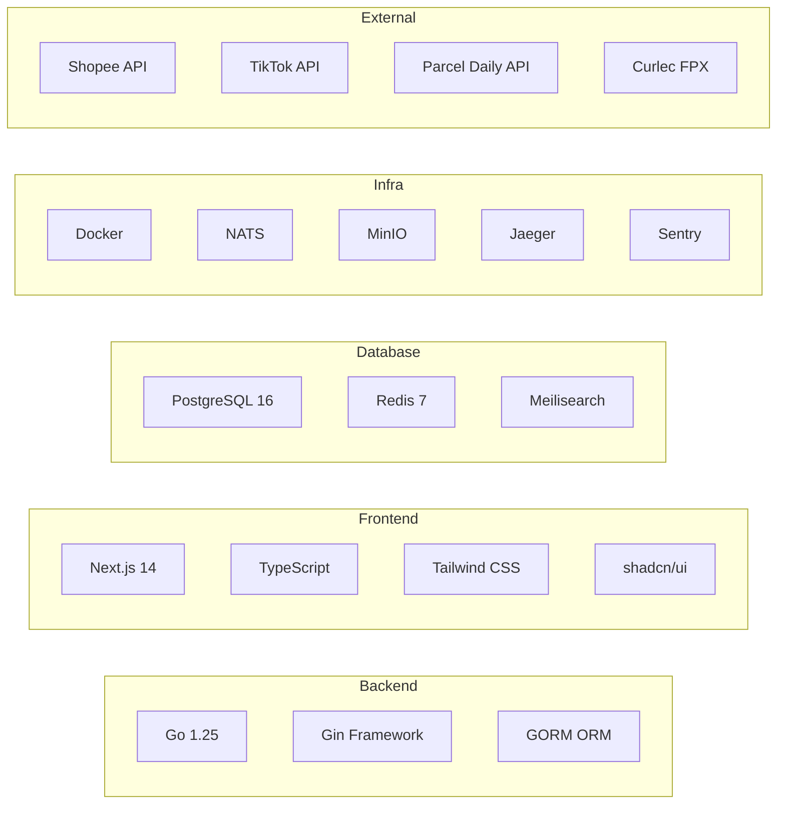
```mermaid
graph LR
    subgraph Backend
        GO["Go 1.25"]
        GIN["Gin Framework"]
        GORM["GORM ORM"]
    end

    subgraph Frontend
        NEXT["Next.js 14"]
        TS["TypeScript"]
        TW["Tailwind CSS"]
        SC["shadcn/ui"]
    end

    subgraph Database
        PG["PostgreSQL 16"]
        RD["Redis 7"]
        MS["Meilisearch"]
    end

    subgraph Infra
        DOCKER["Docker"]
        NATS["NATS"]
        MINIO["MinIO"]
        JAEGER["Jaeger"]
        SENTRY["Sentry"]
    end

    subgraph External
        SHOPEE["Shopee API"]
        TIKTOK["TikTok API"]
        PARCELDAILY["Parcel Daily API"]
        CURLEC["Curlec FPX"]
    end
```

| Layer | Technology | Purpose |
|-------|------------|---------|
| **Backend Language** | Go 1.25 | High-performance microservices |
| **Web Framework** | Gin | HTTP router & middleware |
| **ORM** | GORM | Database interaction with tracing |
| **Frontend Language** | TypeScript | Type safety |
| **UI Framework** | Next.js 14 (App Router) | SSR, routing, API proxy |
| **UI Components** | shadcn/ui + Tailwind CSS | Modern user interface |
| **State Management** | Zustand | Client-side state (storefront) |
| **Animations** | Framer Motion | Smooth UI transitions |
| **Database** | PostgreSQL 16 | Primary data store with 17 schemas |
| **Cache** | Redis 7 | Sessions, rate limiting, distributed locks |
| **Search** | Meilisearch | Fast full-text product search (typo-tolerant) |
| **Message Broker** | NATS JetStream | Inter-service communication (event-driven) |
| **Object Storage** | MinIO | Product images, documents |
| **Image Processing** | Rembg | AI-powered background removal |
| **Payment Gateway** | Curlec FPX | Online banking payments (Malaysia) |
| **Shipping** | Parcel Daily, Pos Laju, SF Express | Three courier providers; Parcel Daily aggregates 16 courier codes |
| **Tracing** | Jaeger + OpenTelemetry | Distributed request tracing |
| **Error Monitoring** | Sentry | Real-time error tracking & alerting |
| **Reverse Proxy** | Nginx | SSL termination, load balancing |
| **Containers** | Docker Compose | Orchestration of 21 containers |

---

## Code Statistics

```
  Source Code Total
  ═══════════════════════════════════════
  Backend (Go)         : 134,275 lines  │   568 files
  Frontend (TS/TSX)    : 153,395 lines  │   636 files
  ─────────────────────────────────────
  TOTAL                : 287,670 lines  │ 1,204 files

  Separate E2E suite   :   1,942 lines  │    21 Playwright specs
```

Counted on 2026-09-03 with `git ls-files '*.go'` and `git ls-files '*.ts' '*.tsx'` piped through `wc -l`, so
these are tracked source files only — no vendored code, no `node_modules`, no generated output. Frontend
totals include `lib-ui` and the in-repo `*.spec.ts` files; the separate line is the standalone Playwright
suite in the umbrella repo.

### Backend — 10 Microservices

| Service | Lines of Go | Description |
|---------|-------------|-------------|
| `service-order` | 31,889 | Cart, orders, payments (Curlec + bank transfer), multi-courier shipping, invoices, refunds, returns |
| `service-catalog` | 29,230 | Products, variants, categories, images, sales channels, flash sales, CMS |
| `service-marketplace` | 17,712 | Shopee & TikTok sync, returns, stock reconciliation |
| `service-inventory` | 10,632 | Stock per warehouse, transfers, low-stock alerts, distributed locking |
| `lib-common` | 9,372 | Shared library (config, db, NATS, auth middleware, outbox, saga, resilience, telemetry) |
| `service-auth` | 8,624 | JWT authentication, RBAC, 2FA (TOTP), activity logging |
| `service-customer` | 7,821 | Customer profiles, addresses, wishlist, tiers, RFM |
| `service-agent` | 6,961 | Sales agents and commissions (DDD) — **legacy, hidden by default** |
| `service-reporting` | 4,667 | Sales reports, analytics, CSV/PDF exports |
| `service-support` | 4,581 | Support tickets, categories, messages, canned responses (DDD) |
| `service-notification` | 2,786 | JetStream consumer: email (SMTP) and SMS (Twilio, stub by default). No HTTP API |

### Frontend — 3 Applications

| Application | Lines of TS/TSX | Description |
|-------------|-----------------|-------------|
| `frontend-admin` | 80,678 | Back-office at `/admin` — every management module |
| `frontend-storefront` | 53,427 | Customer online store: browse, search, cart, checkout, account |
| `lib-ui` | 16,482 | Shared React components (admin uses it heavily, storefront barely) |
| `frontend-warehouse` | 2,808 | Picking / packing PWA — **a mock**: mock login, 4 of its 6 API modules are fixtures |

The sales agent portal was once its own app. It now lives inside the storefront under `/account`
(commissions, customers), with its components shared through `lib-ui/src/agent/`. It is legacy and hidden
behind `NEXT_PUBLIC_FEATURE_AGENTS`, off by default. The agent order wizard was never built.

### Infrastructure

| Component | Count |
|-----------|-------|
| Database Schemas | 17 |
| Database Tables | 132 (plus 3 views) |
| Foreign Keys | 73 |
| Docker Containers | 21 (on the retired VPS) |
| Git Repositories | 19 |
| E2E Test Files | 21 Playwright specs |
| Courier Providers | 3 implemented; Parcel Daily aggregates 16 courier codes |

---

## Enterprise Architecture Patterns

The platform implements enterprise-grade patterns in the shared library (`lib-common/`):

| Pattern | Location | Purpose |
|---------|----------|---------|
| **Saga Orchestrator** | `lib-common/saga/` | Distributed transaction coordination with automatic compensation |
| **Transactional Outbox** | `lib-common/outbox/` | Reliable event publishing with PostgreSQL-backed outbox table |
| **Circuit Breaker** | `lib-common/resilience/` | Fault tolerance — closed/open/half-open states for external calls |
| **Bulkhead** | `lib-common/resilience/` | Resource isolation to prevent cascade failures |
| **Retry with Backoff** | `lib-common/resilience/` | Automatic retry with configurable backoff strategy |
| **Distributed Lock** | `lib-common/lock/` | Redis-based mutual exclusion for critical sections |
| **Event Sourcing** | `lib-common/eventsourcing/` | Domain event persistence with PostgreSQL store and NATS publisher |
| **OpenTelemetry** | `lib-common/telemetry/` | Distributed tracing across HTTP, GORM, NATS with Jaeger export |
| **Sentry Integration** | `lib-common/monitoring/` | Gin middleware for error capture and performance monitoring |

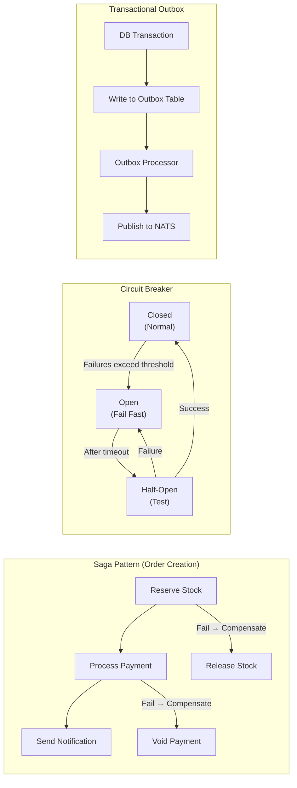
```mermaid
graph LR
    subgraph Saga["Saga Pattern (Order Creation)"]
        S1["Reserve Stock"] --> S2["Process Payment"] --> S3["Send Notification"]
        S1 -->|"Fail → Compensate"| C1["Release Stock"]
        S2 -->|"Fail → Compensate"| C2["Void Payment"]
    end

    subgraph CB["Circuit Breaker"]
        CLOSED["Closed<br/>(Normal)"] -->|"Failures exceed threshold"| OPEN["Open<br/>(Fail Fast)"]
        OPEN -->|"After timeout"| HALF["Half-Open<br/>(Test)"]
        HALF -->|"Success"| CLOSED
        HALF -->|"Failure"| OPEN
    end

    subgraph Outbox["Transactional Outbox"]
        TX["DB Transaction"] --> OB["Write to Outbox Table"]
        OB --> PROC["Outbox Processor"]
        PROC --> PUBLISH["Publish to NATS"]
    end
```

---

## Database Design

A single PostgreSQL database with **16 separate schemas** — each microservice owns its own schema for data isolation (*schema-per-service pattern*).

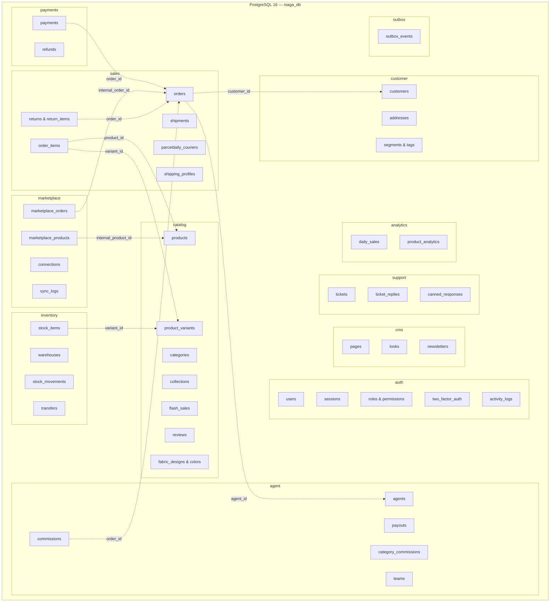
```mermaid
graph TB
    subgraph PostgreSQL["PostgreSQL 16 — niaga_db"]
        subgraph auth_schema["auth"]
            AU_1["users"]
            AU_2["sessions"]
            AU_3["roles & permissions"]
            AU_4["two_factor_auth"]
            AU_5["activity_logs"]
        end

        subgraph catalog_schema["catalog"]
            CA_1["products"]
            CA_2["product_variants"]
            CA_3["categories"]
            CA_4["collections"]
            CA_5["flash_sales"]
            CA_6["reviews"]
            CA_7["fabric_designs & colors"]
        end

        subgraph cms_schema["cms"]
            CM_1["pages"]
            CM_2["looks"]
            CM_3["newsletters"]
        end

        subgraph sales_schema["sales"]
            SA_1["orders"]
            SA_2["order_items"]
            SA_3["shipments"]
            SA_4["returns & return_items"]
            SA_5["parceldaily_couriers"]
            SA_6["shipping_profiles"]
        end

        subgraph payments_schema["payments"]
            PA_1["payments"]
            PA_2["refunds"]
        end

        subgraph inventory_schema["inventory"]
            IN_1["warehouses"]
            IN_2["stock_items"]
            IN_3["stock_movements"]
            IN_4["transfers"]
        end

        subgraph customer_schema["customer"]
            CU_1["customers"]
            CU_2["addresses"]
            CU_3["segments & tags"]
        end

        subgraph agent_schema["agent"]
            AG_1["agents"]
            AG_2["commissions"]
            AG_3["payouts"]
            AG_4["category_commissions"]
            AG_5["teams"]
        end

        subgraph marketplace_schema["marketplace"]
            MK_1["connections"]
            MK_2["marketplace_products"]
            MK_3["marketplace_orders"]
            MK_4["sync_logs"]
        end

        subgraph support_schema["support"]
            SU_1["tickets"]
            SU_2["ticket_replies"]
            SU_3["canned_responses"]
        end

        subgraph analytics_schema["analytics"]
            AN_1["daily_sales"]
            AN_2["product_analytics"]
        end

        subgraph outbox_schema["outbox"]
            OB_1["outbox_events"]
        end
    end

    SA_1 -.->|"customer_id"| CU_1
    SA_1 -.->|"agent_id"| AG_1
    SA_2 -.->|"product_id"| CA_1
    SA_2 -.->|"variant_id"| CA_2
    SA_4 -.->|"order_id"| SA_1
    IN_2 -.->|"variant_id"| CA_2
    AG_2 -.->|"order_id"| SA_1
    MK_3 -.->|"internal_order_id"| SA_1
    MK_2 -.->|"internal_product_id"| CA_1
    PA_1 -.->|"order_id"| SA_1
```

### Database Features

| Feature | Description |
|---------|-------------|
| Schema-per-Service | 17 schemas — clear data isolation per microservice |
| Foreign Key Constraints | Cross-schema references for data integrity |
| Check Constraints | DB-level validation (e.g., order amounts must be positive) |
| Optimized Indexes | B-tree, GIN, and partial indexes for query performance |
| UUID Primary Keys | Every record uses UUID v4 — safe for distributed systems |
| Soft Deletes | Records are not deleted, only marked with `deleted_at` |
| Audit Columns | `created_at`, `updated_at`, `created_by` on every table |
| Transactional Outbox | Dedicated outbox schema for reliable event publishing |
| GORM AutoMigrate | Automatic migration on service startup |

---

## Security

| Layer | Practice |
|-------|----------|
| **Authentication** | JWT (access + refresh token) with Redis sessions |
| **Two-Factor Auth** | TOTP-based 2FA with QR code setup and backup codes |
| **Passwords** | bcrypt hashing with cost factor 12 |
| **Authorization** | Role-Based Access Control (RBAC) — 5 layered roles |
| **Activity Logging** | Full audit trail of user actions |
| **API Protection** | Auth middleware on all protected endpoints |
| **Rate Limiting** | Redis-based rate limiting (10 req/min on auth endpoints) |
| **OAuth Tokens** | Encrypted (AES-256) before storing in DB |
| **CORS** | Strict configuration — only allowed domains |
| **Input Validation** | Input validation on every handler (Gin binding) |
| **SQL Injection** | Prevented by GORM parameterized queries |
| **HTTPS** | SSL/TLS termination at Nginx (Let's Encrypt) |
| **Env Secrets** | Secrets stored as env vars, not in code |
| **Container Security** | `no-new-privileges`, `cap_drop: ALL` on all containers |
| **Webhook Verification** | HMAC signature verification for marketplace webhooks |
| **Distributed Locks** | Redis-based mutual exclusion for critical operations |

---

## Technical Challenges & Solutions

Key technical challenges solved during the development of this platform:

### 1. Multi-Courier Rate Comparison
**Problem:** Malaysian e-commerce needs flexible shipping — different couriers have different rates, coverage areas, and speeds. Manual comparison across 16 couriers is impractical.

**Solution:** Integrated Parcel Daily API as a courier aggregator. The system asks it for rate quotes across the 16 courier codes it knows, presents whichever come back sorted by price, and handles order creation + label generation + webhook tracking through a unified interface.

### 2. Marketplace Order Sync with Shopee Discounts
**Problem:** Shopee allows vouchers/discounts that make order totals lower than the item subtotal. This caused `shipping_cost` to become negative.

**Solution:** Smart logic in `CreateMarketplaceOrder` — when `TotalAmount < subtotal`, the system calculates the difference as a `discount` and sets `shipping_cost = 0`, avoiding negative values.

### 3. Returns & Refund State Machine
**Problem:** Returns involve multiple states (pending, approved, rejected, shipped, received, refunded, exchanged) with different actors (customer, admin, warehouse) and stock implications at each step.

**Solution:** Implemented a state machine pattern in the order service with proper state transitions, validation at each step, automatic stock restoration when returns are received, and support for both refund and exchange outcomes.

### 4. Enterprise Resilience with Saga Pattern
**Problem:** Order creation spans multiple services (catalog validation, stock reservation, payment processing). If any step fails, previous steps must be rolled back.

**Solution:** Implemented Saga Orchestrator pattern in `lib-common/saga/` with automatic compensation. Each step has an execute function and a compensate function. On failure, all completed steps are compensated in reverse order.

### 5. Event-Driven Architecture with Transactional Outbox
**Problem:** Publishing events to NATS after a database transaction risks data inconsistency — the DB commit succeeds but the event publish fails, or vice versa.

**Solution:** Implemented Transactional Outbox pattern (`lib-common/outbox/`). Events are written to an outbox table within the same DB transaction, then a background processor publishes them to NATS and marks them as processed.

### 6. Shopee OAuth Token Expiry Management
**Problem:** Shopee OAuth tokens expire every 4 hours. If a token expires during auto-sync, all operations would fail.

**Solution:** Background token manager checking every 5 minutes, refreshing tokens 30 minutes before expiry to ensure continuous activation.

### 7. SKU Matching Across Platforms
**Problem:** Products on Shopee use different SKUs from the internal system. Shopee orders need linking to internal products for inventory tracking.

**Solution:** SKU matching system mapping `external_sku` to `internal_product_id` during product sync, enabling stock tracking across channels.

### 8. One Database, 17 Separate Schemas
**Problem:** How to isolate data for 10 microservices without running 10 databases (overhead on single VPS).

**Solution:** Schema-per-service pattern — one PostgreSQL database (`niaga_db`) with 17 schemas. Each service accesses only its schema with cross-reference capability.

---

## Monitoring & Reliability

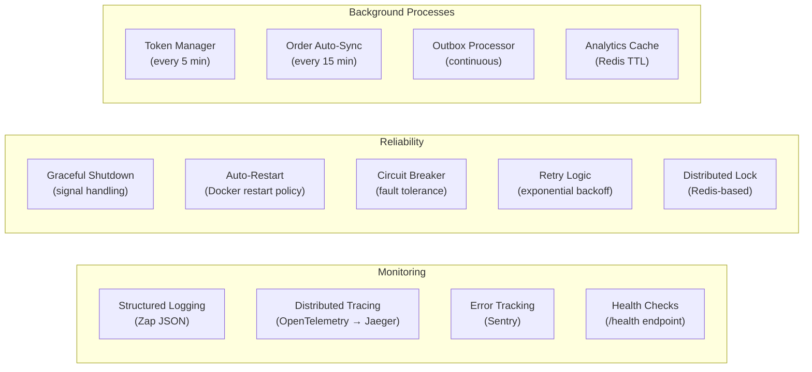
```mermaid
graph LR
    subgraph Observability["Monitoring"]
        LOG["Structured Logging<br/>(Zap JSON)"]
        TRACE["Distributed Tracing<br/>(OpenTelemetry → Jaeger)"]
        ERROR["Error Tracking<br/>(Sentry)"]
        HEALTH["Health Checks<br/>(/health endpoint)"]
    end

    subgraph Reliability["Reliability"]
        GRACEFUL["Graceful Shutdown<br/>(signal handling)"]
        RESTART["Auto-Restart<br/>(Docker restart policy)"]
        CB["Circuit Breaker<br/>(fault tolerance)"]
        RETRY["Retry Logic<br/>(exponential backoff)"]
        LOCK["Distributed Lock<br/>(Redis-based)"]
    end

    subgraph Background["Background Processes"]
        TOKEN["Token Manager<br/>(every 5 min)"]
        SYNC["Order Auto-Sync<br/>(every 15 min)"]
        OUTBOX["Outbox Processor<br/>(continuous)"]
        CACHE["Analytics Cache<br/>(Redis TTL)"]
    end
```

| Feature | Description |
|---------|-------------|
| **Structured Logging** | All services use Zap JSON logger — easy to search and analyze |
| **Distributed Tracing** | OpenTelemetry + Jaeger — trace requests across HTTP, GORM, NATS |
| **Error Monitoring** | Sentry integration via Gin middleware — real-time error capture |
| **Health Checks** | Every service exposes `/health` — Docker checks periodically |
| **Graceful Shutdown** | Handles OS signals (SIGTERM/SIGINT) — completes active requests before shutting down |
| **Auto-Restart** | Docker `restart: unless-stopped` — services recover automatically after failure |
| **Circuit Breaker** | Prevents cascade failures when external services are down |
| **Transactional Outbox** | Background processor ensures reliable event delivery |
| **Background Schedulers** | Token refresh (5 min), order auto-sync (15 min), analytics cache |
| **Error Recovery** | Retry logic on inter-service HTTP calls with exponential backoff |

---

## System Flows

### 1. Authentication & Authorization

The authentication system uses JWT with Redis sessions and optional 2FA. Every request goes through middleware that validates the token and checks user roles.

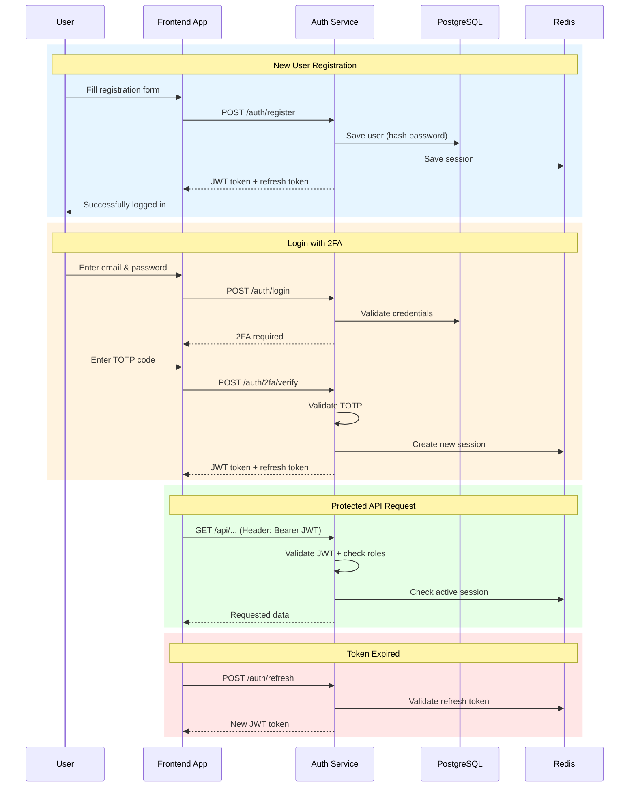
```mermaid
sequenceDiagram
    participant U as User
    participant FE as Frontend App
    participant AUTH as Auth Service
    participant DB as PostgreSQL
    participant RD as Redis

    rect rgb(230, 245, 255)
    Note over U,RD: New User Registration
    U->>FE: Fill registration form
    FE->>AUTH: POST /auth/register
    AUTH->>DB: Save user (hash password)
    AUTH->>RD: Save session
    AUTH-->>FE: JWT token + refresh token
    FE-->>U: Successfully logged in
    end

    rect rgb(255, 243, 224)
    Note over U,RD: Login with 2FA
    U->>FE: Enter email & password
    FE->>AUTH: POST /auth/login
    AUTH->>DB: Validate credentials
    AUTH-->>FE: 2FA required
    U->>FE: Enter TOTP code
    FE->>AUTH: POST /auth/2fa/verify
    AUTH->>AUTH: Validate TOTP
    AUTH->>RD: Create new session
    AUTH-->>FE: JWT token + refresh token
    end

    rect rgb(230, 255, 230)
    Note over FE,RD: Protected API Request
    FE->>AUTH: GET /api/... (Header: Bearer JWT)
    AUTH->>AUTH: Validate JWT + check roles
    AUTH->>RD: Check active session
    AUTH-->>FE: Requested data
    end

    rect rgb(255, 230, 230)
    Note over FE,RD: Token Expired
    FE->>AUTH: POST /auth/refresh
    AUTH->>RD: Validate refresh token
    AUTH-->>FE: New JWT token
    end
```

**User roles:** `superadmin` → `admin` → `staff` → `agent` → `customer`

---

### 2. Product Catalog

Complete product management with variant support, images (MinIO), AI background removal (Rembg), fast search (Meilisearch), flash sales, and automatic marketplace sync.

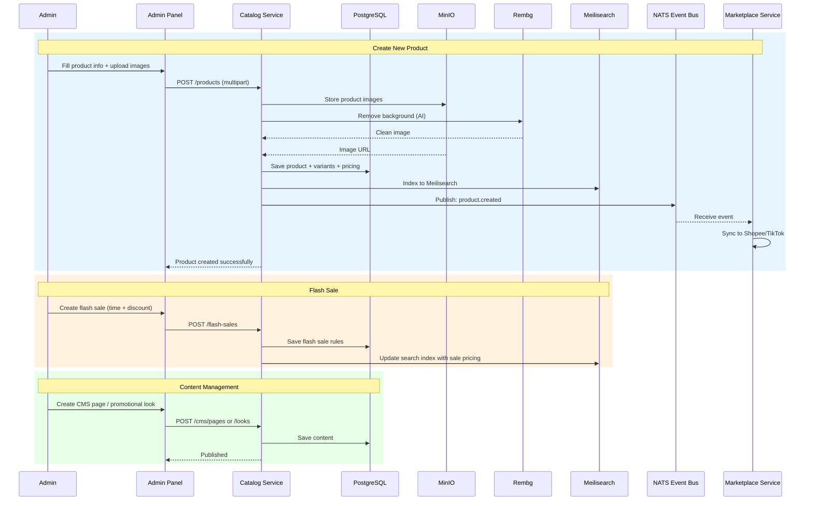
```mermaid
sequenceDiagram
    participant A as Admin
    participant FE as Admin Panel
    participant CAT as Catalog Service
    participant DB as PostgreSQL
    participant MIO as MinIO
    participant REMBG as Rembg
    participant MS as Meilisearch
    participant NATS as NATS Event Bus
    participant MKT as Marketplace Service

    rect rgb(230, 245, 255)
    Note over A,MKT: Create New Product
    A->>FE: Fill product info + upload images
    FE->>CAT: POST /products (multipart)
    CAT->>MIO: Store product images
    CAT->>REMBG: Remove background (AI)
    REMBG-->>CAT: Clean image
    MIO-->>CAT: Image URL
    CAT->>DB: Save product + variants + pricing
    CAT->>MS: Index to Meilisearch
    CAT->>NATS: Publish: product.created
    NATS-->>MKT: Receive event
    MKT->>MKT: Sync to Shopee/TikTok
    CAT-->>FE: Product created successfully
    end

    rect rgb(255, 243, 224)
    Note over A,MS: Flash Sale
    A->>FE: Create flash sale (time + discount)
    FE->>CAT: POST /flash-sales
    CAT->>DB: Save flash sale rules
    CAT->>MS: Update search index with sale pricing
    end

    rect rgb(230, 255, 230)
    Note over A,DB: Content Management
    A->>FE: Create CMS page / promotional look
    FE->>CAT: POST /cms/pages or /looks
    CAT->>DB: Save content
    CAT-->>FE: Published
    end
```

---

### 3. Complete Order Flow — All Channels

Orders can come from 4 different channels: website, sales agents, manual admin entry, and marketplace (Shopee/TikTok). All orders are unified in a single system.

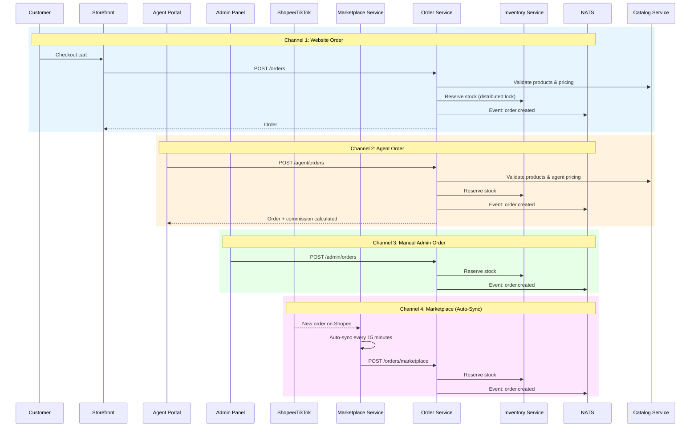
```mermaid
sequenceDiagram
    participant P as Customer
    participant ST as Storefront
    participant AG as Agent Portal
    participant AD as Admin Panel
    participant SH as Shopee/TikTok
    participant MKT as Marketplace Service
    participant ORD as Order Service
    participant INV as Inventory Service
    participant NATS as NATS
    participant CAT as Catalog Service

    rect rgb(230, 245, 255)
    Note over P,NATS: Channel 1: Website Order
    P->>ST: Checkout cart
    ST->>ORD: POST /orders
    ORD->>CAT: Validate products & pricing
    ORD->>INV: Reserve stock (distributed lock)
    ORD->>NATS: Event: order.created
    ORD-->>ST: Order #KDM-20250208-001
    end

    rect rgb(255, 243, 224)
    Note over AG,NATS: Channel 2: Agent Order
    AG->>ORD: POST /agent/orders
    ORD->>CAT: Validate products & agent pricing
    ORD->>INV: Reserve stock
    ORD->>NATS: Event: order.created
    ORD-->>AG: Order + commission calculated
    end

    rect rgb(230, 255, 230)
    Note over AD,NATS: Channel 3: Manual Admin Order
    AD->>ORD: POST /admin/orders
    ORD->>INV: Reserve stock
    ORD->>NATS: Event: order.created
    end

    rect rgb(255, 230, 255)
    Note over SH,NATS: Channel 4: Marketplace (Auto-Sync)
    SH-->>MKT: New order on Shopee
    MKT->>MKT: Auto-sync every 15 minutes
    MKT->>ORD: POST /orders/marketplace
    ORD->>INV: Reserve stock
    ORD->>NATS: Event: order.created
    end
```

---

### 4. Order Lifecycle

Every order goes through several statuses from start to completion, including returns.

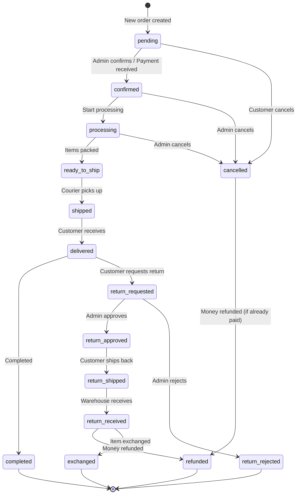
```mermaid
stateDiagram-v2
    [*] --> pending: New order created

    pending --> confirmed: Admin confirms / Payment received
    pending --> cancelled: Customer cancels

    confirmed --> processing: Start processing
    confirmed --> cancelled: Admin cancels

    processing --> ready_to_ship: Items packed
    processing --> cancelled: Admin cancels

    ready_to_ship --> shipped: Courier picks up
    shipped --> delivered: Customer receives

    delivered --> completed: Completed
    delivered --> return_requested: Customer requests return

    return_requested --> return_approved: Admin approves
    return_requested --> return_rejected: Admin rejects
    return_approved --> return_shipped: Customer ships back
    return_shipped --> return_received: Warehouse receives
    return_received --> refunded: Money refunded
    return_received --> exchanged: Item exchanged

    cancelled --> refunded: Money refunded (if already paid)

    completed --> [*]
    refunded --> [*]
    exchanged --> [*]
    return_rejected --> [*]
```

---

### 5. Multi-Courier Shipping Flow

Rate comparison across 16 couriers, label generation, and webhook tracking via Parcel Daily.

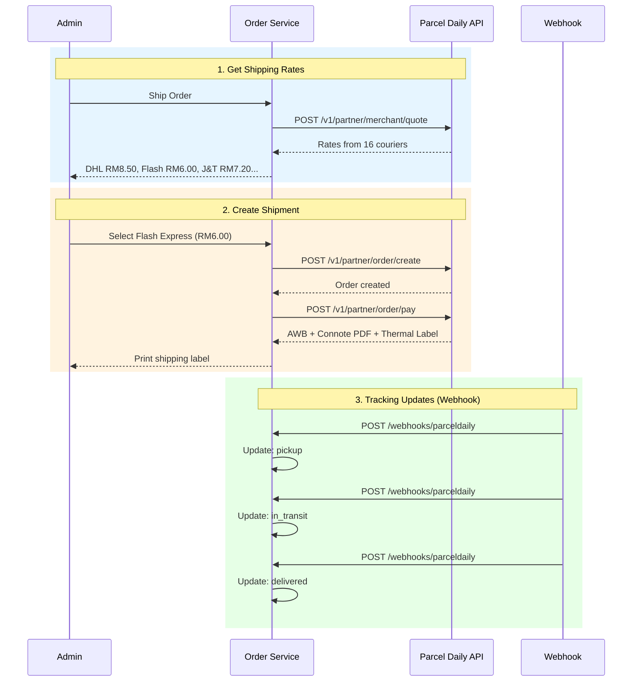
```mermaid
sequenceDiagram
    participant AD as Admin
    participant ORD as Order Service
    participant PD as Parcel Daily API
    participant WH as Webhook

    rect rgb(230, 245, 255)
    Note over AD,PD: 1. Get Shipping Rates
    AD->>ORD: Ship Order #ORD-001
    ORD->>PD: POST /v1/partner/merchant/quote
    PD-->>ORD: Rates from 16 couriers
    ORD-->>AD: DHL RM8.50, Flash RM6.00, J&T RM7.20...
    end

    rect rgb(255, 243, 224)
    Note over AD,PD: 2. Create Shipment
    AD->>ORD: Select Flash Express (RM6.00)
    ORD->>PD: POST /v1/partner/order/create
    PD-->>ORD: Order created
    ORD->>PD: POST /v1/partner/order/pay
    PD-->>ORD: AWB + Connote PDF + Thermal Label
    ORD-->>AD: Print shipping label
    end

    rect rgb(230, 255, 230)
    Note over ORD,WH: 3. Tracking Updates (Webhook)
    WH->>ORD: POST /webhooks/parceldaily
    ORD->>ORD: Update: pickup
    WH->>ORD: POST /webhooks/parceldaily
    ORD->>ORD: Update: in_transit
    WH->>ORD: POST /webhooks/parceldaily
    ORD->>ORD: Update: delivered
    end
```

---

### 6. Payment Flow

Multiple payment methods with automated and manual verification.

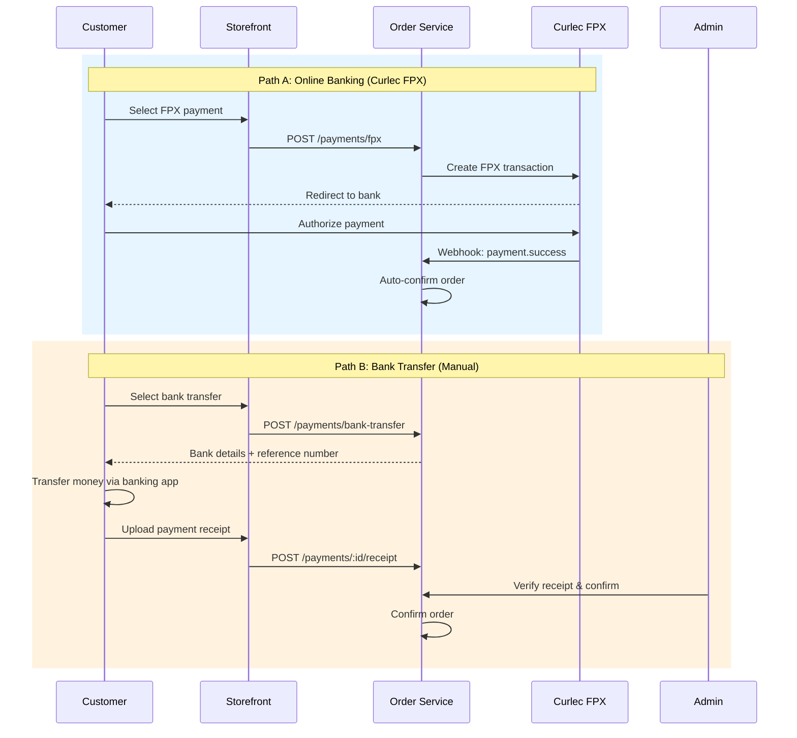
```mermaid
sequenceDiagram
    participant P as Customer
    participant ST as Storefront
    participant ORD as Order Service
    participant CURLEC as Curlec FPX
    participant AD as Admin

    rect rgb(230, 245, 255)
    Note over P,CURLEC: Path A: Online Banking (Curlec FPX)
    P->>ST: Select FPX payment
    ST->>ORD: POST /payments/fpx
    ORD->>CURLEC: Create FPX transaction
    CURLEC-->>P: Redirect to bank
    P->>CURLEC: Authorize payment
    CURLEC->>ORD: Webhook: payment.success
    ORD->>ORD: Auto-confirm order
    end

    rect rgb(255, 243, 224)
    Note over P,AD: Path B: Bank Transfer (Manual)
    P->>ST: Select bank transfer
    ST->>ORD: POST /payments/bank-transfer
    ORD-->>P: Bank details + reference number
    P->>P: Transfer money via banking app
    P->>ST: Upload payment receipt
    ST->>ORD: POST /payments/:id/receipt
    AD->>ORD: Verify receipt & confirm
    ORD->>ORD: Confirm order
    end
```

---

### 7. Inventory & Warehouse

Real-time stock management across multiple warehouses with distributed locking.

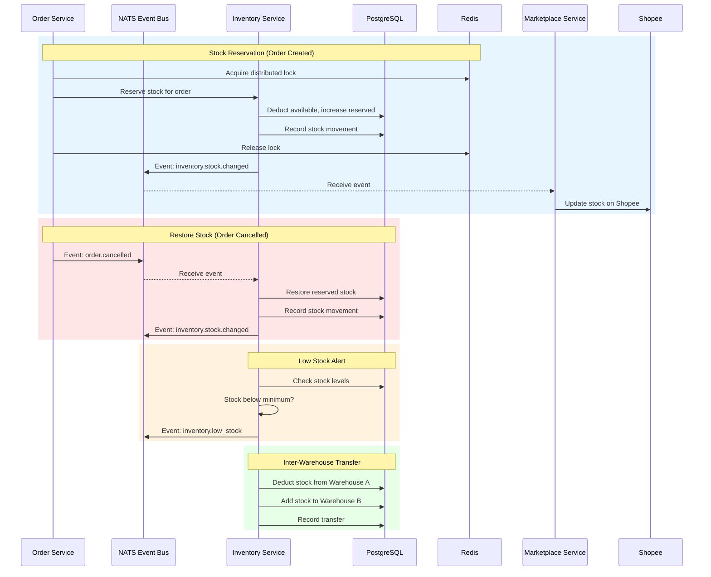
```mermaid
sequenceDiagram
    participant ORD as Order Service
    participant NATS as NATS Event Bus
    participant INV as Inventory Service
    participant DB as PostgreSQL
    participant RD as Redis
    participant MKT as Marketplace Service
    participant SH as Shopee

    rect rgb(230, 245, 255)
    Note over ORD,RD: Stock Reservation (Order Created)
    ORD->>RD: Acquire distributed lock
    ORD->>INV: Reserve stock for order
    INV->>DB: Deduct available, increase reserved
    INV->>DB: Record stock movement
    ORD->>RD: Release lock
    INV->>NATS: Event: inventory.stock.changed
    NATS-->>MKT: Receive event
    MKT->>SH: Update stock on Shopee
    end

    rect rgb(255, 230, 230)
    Note over ORD,DB: Restore Stock (Order Cancelled)
    ORD->>NATS: Event: order.cancelled
    NATS-->>INV: Receive event
    INV->>DB: Restore reserved stock
    INV->>DB: Record stock movement
    INV->>NATS: Event: inventory.stock.changed
    end

    rect rgb(255, 243, 224)
    Note over INV,DB: Low Stock Alert
    INV->>DB: Check stock levels
    INV->>INV: Stock below minimum?
    INV->>NATS: Event: inventory.low_stock
    end

    rect rgb(230, 255, 230)
    Note over INV,DB: Inter-Warehouse Transfer
    INV->>DB: Deduct stock from Warehouse A
    INV->>DB: Add stock to Warehouse B
    INV->>DB: Record transfer
    end
```

---

### 8. Marketplace Integration — Shopee & TikTok

Full integration including OAuth, product sync, automatic orders, returns processing, stock reconciliation, and token management.

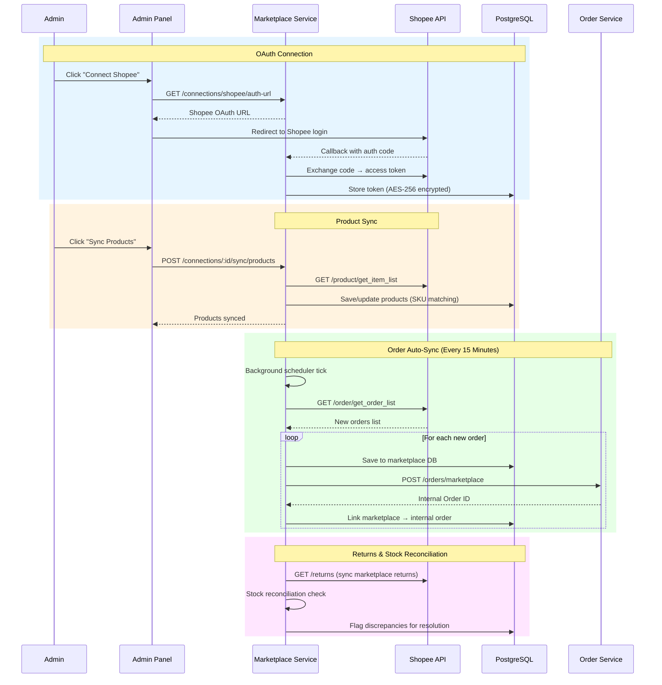
```mermaid
sequenceDiagram
    participant A as Admin
    participant FE as Admin Panel
    participant MKT as Marketplace Service
    participant SH as Shopee API
    participant DB as PostgreSQL
    participant ORD as Order Service

    rect rgb(230, 245, 255)
    Note over A,DB: OAuth Connection
    A->>FE: Click "Connect Shopee"
    FE->>MKT: GET /connections/shopee/auth-url
    MKT-->>FE: Shopee OAuth URL
    FE->>SH: Redirect to Shopee login
    SH-->>MKT: Callback with auth code
    MKT->>SH: Exchange code → access token
    MKT->>DB: Store token (AES-256 encrypted)
    end

    rect rgb(255, 243, 224)
    Note over MKT,SH: Product Sync
    A->>FE: Click "Sync Products"
    FE->>MKT: POST /connections/:id/sync/products
    MKT->>SH: GET /product/get_item_list
    MKT->>DB: Save/update products (SKU matching)
    MKT-->>FE: Products synced
    end

    rect rgb(230, 255, 230)
    Note over MKT,ORD: Order Auto-Sync (Every 15 Minutes)
    MKT->>MKT: Background scheduler tick
    MKT->>SH: GET /order/get_order_list
    SH-->>MKT: New orders list
    loop For each new order
        MKT->>DB: Save to marketplace DB
        MKT->>ORD: POST /orders/marketplace
        ORD-->>MKT: Internal Order ID
        MKT->>DB: Link marketplace → internal order
    end
    end

    rect rgb(255, 230, 255)
    Note over MKT,DB: Returns & Stock Reconciliation
    MKT->>SH: GET /returns (sync marketplace returns)
    MKT->>MKT: Stock reconciliation check
    MKT->>DB: Flag discrepancies for resolution
    end
```

---

### 9. Agent Commission Flow *(legacy — off by default)*

Sales agents register through admin, place orders, and earn category-specific commissions.

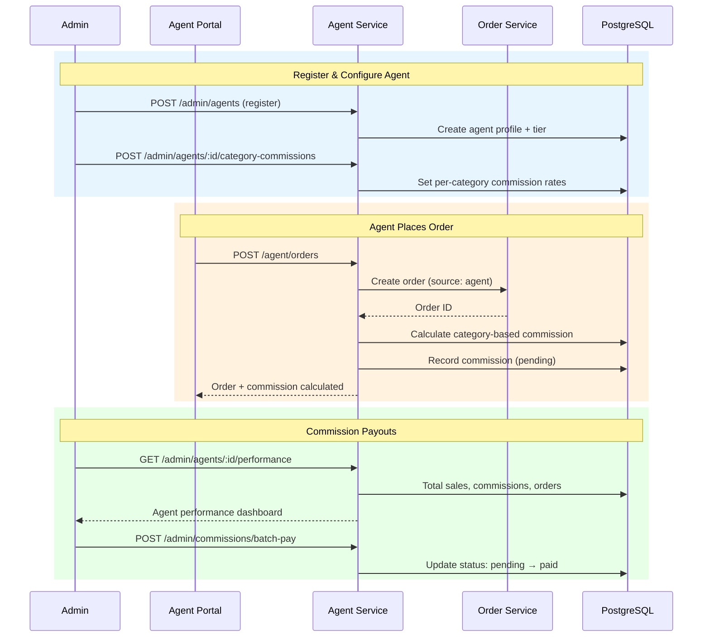
```mermaid
sequenceDiagram
    participant AD as Admin
    participant AGP as Agent Portal
    participant AGT as Agent Service
    participant ORD as Order Service
    participant DB as PostgreSQL

    rect rgb(230, 245, 255)
    Note over AD,DB: Register & Configure Agent
    AD->>AGT: POST /admin/agents (register)
    AGT->>DB: Create agent profile + tier
    AD->>AGT: POST /admin/agents/:id/category-commissions
    AGT->>DB: Set per-category commission rates
    end

    rect rgb(255, 243, 224)
    Note over AGP,DB: Agent Places Order
    AGP->>AGT: POST /agent/orders
    AGT->>ORD: Create order (source: agent)
    ORD-->>AGT: Order ID
    AGT->>DB: Calculate category-based commission
    AGT->>DB: Record commission (pending)
    AGT-->>AGP: Order + commission calculated
    end

    rect rgb(230, 255, 230)
    Note over AD,DB: Commission Payouts
    AD->>AGT: GET /admin/agents/:id/performance
    AGT->>DB: Total sales, commissions, orders
    AGT-->>AD: Agent performance dashboard
    AD->>AGT: POST /admin/commissions/batch-pay
    AGT->>DB: Update status: pending → paid
    end
```

---

### 10. Support Tickets

Ticket system for managing customer inquiries and complaints with canned responses.

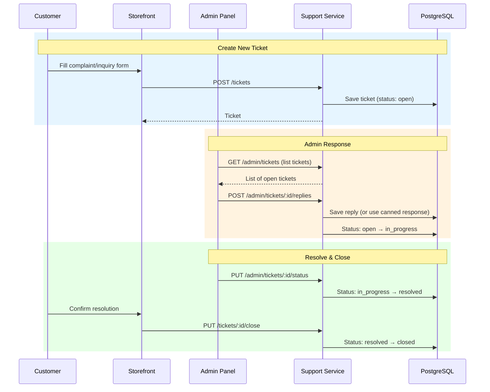
```mermaid
sequenceDiagram
    participant P as Customer
    participant ST as Storefront
    participant AD as Admin Panel
    participant SUP as Support Service
    participant DB as PostgreSQL

    rect rgb(230, 245, 255)
    Note over P,DB: Create New Ticket
    P->>ST: Fill complaint/inquiry form
    ST->>SUP: POST /tickets
    SUP->>DB: Save ticket (status: open)
    SUP-->>ST: Ticket #TIK-001
    end

    rect rgb(255, 243, 224)
    Note over AD,DB: Admin Response
    AD->>SUP: GET /admin/tickets (list tickets)
    SUP-->>AD: List of open tickets
    AD->>SUP: POST /admin/tickets/:id/replies
    SUP->>DB: Save reply (or use canned response)
    SUP->>DB: Status: open → in_progress
    end

    rect rgb(230, 255, 230)
    Note over AD,DB: Resolve & Close
    AD->>SUP: PUT /admin/tickets/:id/status
    SUP->>DB: Status: in_progress → resolved
    P->>ST: Confirm resolution
    ST->>SUP: PUT /tickets/:id/close
    SUP->>DB: Status: resolved → closed
    end
```

---

### 11. Reports & Analytics

Real-time analytics dashboard for monitoring business performance.

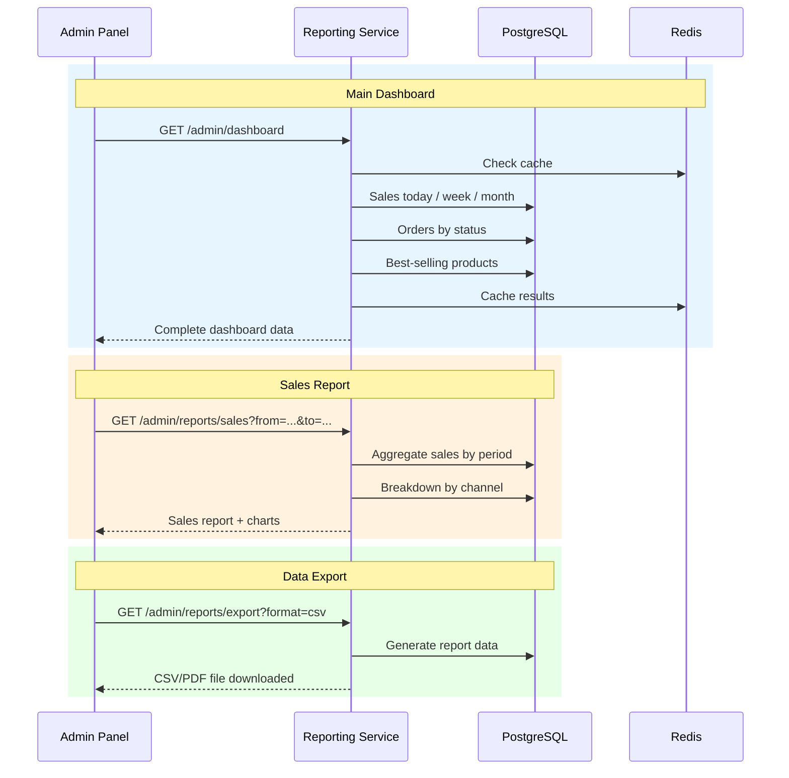
```mermaid
sequenceDiagram
    participant AD as Admin Panel
    participant RPT as Reporting Service
    participant DB as PostgreSQL
    participant RD as Redis

    rect rgb(230, 245, 255)
    Note over AD,RD: Main Dashboard
    AD->>RPT: GET /admin/dashboard
    RPT->>RD: Check cache
    RPT->>DB: Sales today / week / month
    RPT->>DB: Orders by status
    RPT->>DB: Best-selling products
    RPT->>RD: Cache results
    RPT-->>AD: Complete dashboard data
    end

    rect rgb(255, 243, 224)
    Note over AD,DB: Sales Report
    AD->>RPT: GET /admin/reports/sales?from=...&to=...
    RPT->>DB: Aggregate sales by period
    RPT->>DB: Breakdown by channel
    RPT-->>AD: Sales report + charts
    end

    rect rgb(230, 255, 230)
    Note over AD,DB: Data Export
    AD->>RPT: GET /admin/reports/export?format=csv
    RPT->>DB: Generate report data
    RPT-->>AD: CSV/PDF file downloaded
    end
```

---

### 12. Inter-Service Communication

Complete communication map between all microservices via NATS Event Bus, transactional outbox, and direct HTTP calls.

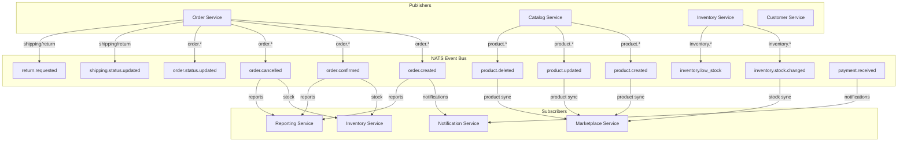
```mermaid
graph TB
    subgraph NATS_Events["NATS Event Bus"]
        direction TB
        E1["order.created"]
        E2["order.confirmed"]
        E3["order.cancelled"]
        E4["order.status.updated"]
        E5["product.created"]
        E6["product.updated"]
        E7["product.deleted"]
        E8["inventory.stock.changed"]
        E9["inventory.low_stock"]
        E10["shipping.status.updated"]
        E11["return.requested"]
        E12["payment.received"]
    end

    subgraph Publishers["Publishers"]
        ORD_P["Order Service"]
        CAT_P["Catalog Service"]
        INV_P["Inventory Service"]
        CUST_P["Customer Service"]
    end

    subgraph Subscribers["Subscribers"]
        INV_S["Inventory Service"]
        MKT_S["Marketplace Service"]
        NOTIF_S["Notification Service"]
        RPT_S["Reporting Service"]
    end

    ORD_P -->|order.*| E1 & E2 & E3 & E4
    CAT_P -->|product.*| E5 & E6 & E7
    INV_P -->|inventory.*| E8 & E9
    ORD_P -->|shipping/return| E10 & E11

    E2 & E3 -->|stock| INV_S
    E5 & E6 & E7 -->|product sync| MKT_S
    E8 -->|stock sync| MKT_S
    E1 & E12 -->|notifications| NOTIF_S
    E1 & E2 & E3 -->|reports| RPT_S
```

#### Inter-Service HTTP Calls

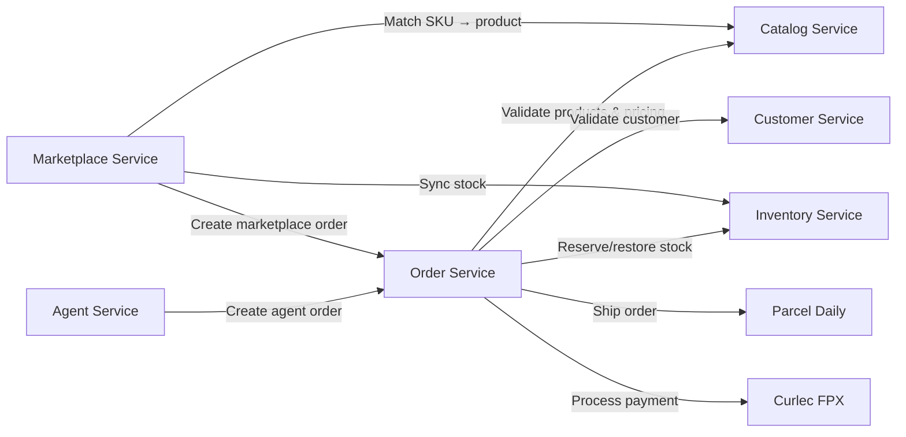
```mermaid
graph LR
    ORD["Order Service"]
    CAT["Catalog Service"]
    INV["Inventory Service"]
    AGT["Agent Service"]
    MKT["Marketplace Service"]
    CUST["Customer Service"]
    PD["Parcel Daily"]
    CURLEC["Curlec FPX"]

    ORD -->|"Validate products & pricing"| CAT
    ORD -->|"Reserve/restore stock"| INV
    ORD -->|"Validate customer"| CUST
    ORD -->|"Ship order"| PD
    ORD -->|"Process payment"| CURLEC
    AGT -->|"Create agent order"| ORD
    MKT -->|"Create marketplace order"| ORD
    MKT -->|"Match SKU → product"| CAT
    MKT -->|"Sync stock"| INV
```

---

### 13. User Flow — Online Store (Storefront)

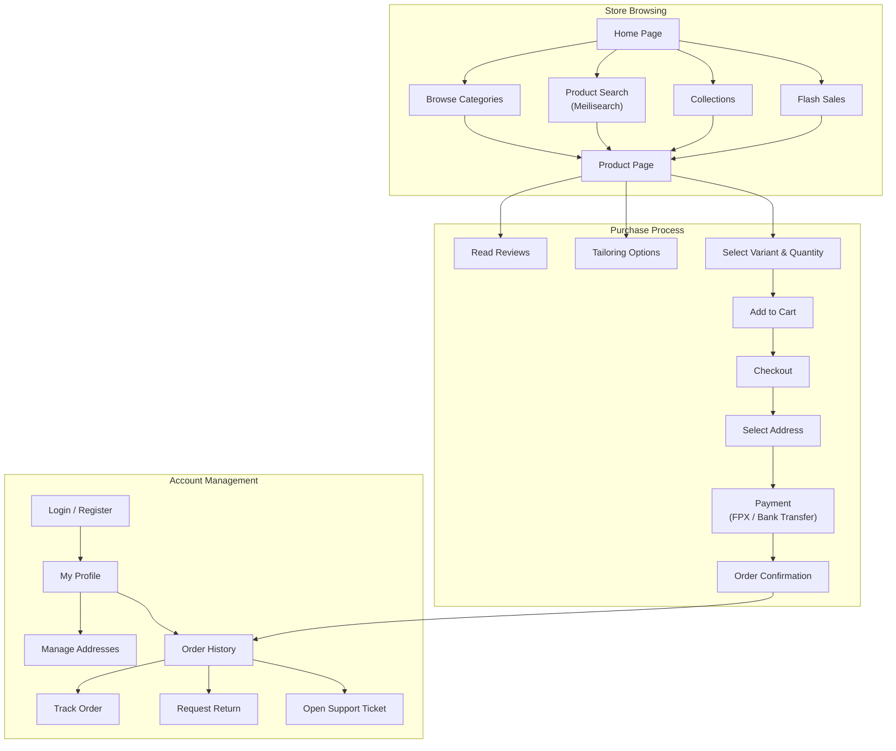
```mermaid
graph TB
    subgraph Browsing["Store Browsing"]
        HOME["Home Page"] --> BROWSE["Browse Categories"]
        HOME --> SEARCH["Product Search<br/>(Meilisearch)"]
        HOME --> COLL["Collections"]
        HOME --> FLASH["Flash Sales"]
        BROWSE --> PDP["Product Page"]
        SEARCH --> PDP
        COLL --> PDP
        FLASH --> PDP
    end

    subgraph Purchase["Purchase Process"]
        PDP --> REVIEW["Read Reviews"]
        PDP --> TAILOR["Tailoring Options"]
        PDP --> VARIANT["Select Variant & Quantity"]
        VARIANT --> CART["Add to Cart"]
        CART --> CHECKOUT["Checkout"]
        CHECKOUT --> ADDRESS["Select Address"]
        ADDRESS --> PAY["Payment<br/>(FPX / Bank Transfer)"]
        PAY --> CONFIRM["Order Confirmation"]
    end

    subgraph Account["Account Management"]
        LOGIN["Login / Register"]
        PROFILE["My Profile"]
        ADDR_MGMT["Manage Addresses"]
        ORDER_HIST["Order History"]
        TRACK["Track Order"]
        RETURN["Request Return"]
        TICKET["Open Support Ticket"]

        LOGIN --> PROFILE
        PROFILE --> ADDR_MGMT
        PROFILE --> ORDER_HIST
        ORDER_HIST --> TRACK
        ORDER_HIST --> RETURN
        ORDER_HIST --> TICKET
    end

    CONFIRM --> ORDER_HIST
```

---

### 14. User Flow — Admin Panel


```mermaid
graph TB
    subgraph Dashboard["Main Dashboard"]
        DASH["Sales & Orders Summary"]
    end

    subgraph Products["Product Management"]
        PROD_LIST["Product List"]
        PROD_ADD["Add Product"]
        PROD_EDIT["Edit Product & Variants"]
        CAT_MGMT["Categories & Collections"]
        FLASH_MGMT["Flash Sales"]
        REVIEW_MOD["Review Moderation"]
        PROD_LIST --> PROD_ADD
        PROD_LIST --> PROD_EDIT
        PROD_LIST --> CAT_MGMT
        PROD_LIST --> FLASH_MGMT
        PROD_LIST --> REVIEW_MOD
    end

    subgraph Content["Content Management"]
        CMS_PAGES["CMS Pages"]
        LOOKS["Promotional Looks"]
        NEWSLETTER["Newsletter"]
    end

    subgraph Orders["Order Management"]
        ORD_LIST["Order List"]
        ORD_DETAIL["Order Details"]
        ORD_STATUS["Update Status"]
        ORD_SHIP["Ship Order (16 Couriers)"]
        ORD_RETURN["Process Returns"]
        ORD_MANUAL["Create Manual Order"]
        ORD_LIST --> ORD_DETAIL
        ORD_DETAIL --> ORD_STATUS
        ORD_DETAIL --> ORD_SHIP
        ORD_DETAIL --> ORD_RETURN
        ORD_LIST --> ORD_MANUAL
    end

    subgraph Inventory["Inventory & Warehouse"]
        STOCK["Stock Levels"]
        WAREHOUSE["Manage Warehouses"]
        TRANSFER["Stock Transfers"]
        ALERTS["Low Stock Alerts"]
        STOCK --> TRANSFER
        STOCK --> ALERTS
        STOCK --> WAREHOUSE
    end

    subgraph Customers["Customers & CRM"]
        CUST_LIST["Customer List"]
        CUST_DETAIL["Customer Profile"]
        CUST_SEG["Segments & Tags"]
        CUST_IMPORT["CSV Import"]
        CUST_LIST --> CUST_DETAIL
        CUST_LIST --> CUST_SEG
        CUST_LIST --> CUST_IMPORT
    end

    subgraph Marketplace["Marketplace Integration"]
        MKT_CONN["Shopee/TikTok Connections"]
        MKT_PROD["Product Sync"]
        MKT_ORD["Order Sync"]
        MKT_RETURN["Returns Processing"]
        MKT_RECON["Stock Reconciliation"]
        MKT_ANALYTICS["Marketplace Analytics"]
        MKT_CONN --> MKT_PROD
        MKT_CONN --> MKT_ORD
        MKT_CONN --> MKT_RETURN
        MKT_CONN --> MKT_RECON
        MKT_CONN --> MKT_ANALYTICS
    end

    subgraph Agents["Agent Management"]
        AGT_LIST["Agent List"]
        AGT_COMM["Commissions & Payments"]
        AGT_CAT_COMM["Category Commission Rates"]
        AGT_PERF["Agent Performance"]
        AGT_TEAM["Team Management"]
        AGT_LIST --> AGT_COMM
        AGT_LIST --> AGT_CAT_COMM
        AGT_LIST --> AGT_PERF
        AGT_LIST --> AGT_TEAM
    end

    subgraph Reports["Reports & Analytics"]
        RPT_SALES["Daily/Monthly Sales"]
        RPT_PRODUCT["Product Performance"]
        RPT_EXPORT["CSV/PDF Export"]
        RPT_SALES --> RPT_EXPORT
        RPT_PRODUCT --> RPT_EXPORT
    end

    subgraph Support["Customer Support"]
        TIK_LIST["Ticket List"]
        TIK_REPLY["Reply to Tickets"]
        TIK_LIST --> TIK_REPLY
    end

    DASH --> Products
    DASH --> Content
    DASH --> Orders
    DASH --> Inventory
    DASH --> Customers
    DASH --> Marketplace
    DASH --> Agents
    DASH --> Reports
    DASH --> Support
```

---

## E2E Testing

Comprehensive end-to-end testing with **Playwright** covering all service domains:

| Domain | Test Files | Coverage |
|--------|-----------|----------|
| **Order** | 6 files | Cart, checkout, lifecycle, payment, shipping, returns |
| **Catalog** | 4 files | Products, categories, CMS, search |
| **Cross-Service** | 3 files | Full purchase flow, RBAC enforcement, returns |
| **Auth** | 2 files | Login, RBAC enforcement |
| **Customer** | 1 file | Profile management |
| **Inventory** | 1 file | Stock operations |
| **Marketplace** | 1 file | Connections |
| **Agent** | 1 file | Agent CRUD, commissions *(legacy)* |
| **Reporting** | 1 file | Sales reports |
| **Support** | 1 file | Support tickets |

**21 test files** | **1,942 lines** | **10 service domains** | Rate-limit handling & retry logic built-in

Counted from the tracked `*.spec.ts` files in the umbrella repo's `e2e-tests/`. The three frontends carry
their own in-repo Playwright specs on top of this.

---

## Deployment

### How it ran in production — 2023 to 2026, now retired

All services ran in Docker containers on a single VPS with Docker Compose. That deployment has been shut down;
the scripts remain in `infra-platform` for reference.

```
  Production Infrastructure (retired)
  ════════════════════════════════════════
  Server         : 1x VPS (4GB RAM, 2vCPU)
  Containers     : 21 Docker containers
  Orchestration  : Docker Compose
  Reverse Proxy  : Nginx + SSL (Let's Encrypt)
  Database       : PostgreSQL 16 (17 schemas)
  Cache          : Redis 7
  Search         : Meilisearch
  Event Bus      : NATS JetStream
  Object Storage : MinIO
  Image AI       : Rembg (background removal)
  Tracing        : Jaeger + OpenTelemetry
  Monitoring     : Sentry (error tracking)
```

| Operational Feature | Description |
|---------------------|-------------|
| Container Security | `no-new-privileges`, `cap_drop: ALL` on all containers |
| Health Checks | Every service exposes `/health` — Docker checks periodically |
| Structured Logging | JSON logging (Zap) — easy to search and debug |
| Distributed Tracing | OpenTelemetry → Jaeger — trace requests across services |
| Error Monitoring | Sentry — real-time error capture and alerting |
| Graceful Shutdown | Signal handling (SIGTERM) — completes requests before shutting down |
| Auto-Restart | `restart: unless-stopped` — recovers automatically after failure |
| Background Jobs | Token refresh (5 min), order sync (15 min), outbox processor |

### How it runs today

The platform runs end to end on a local development stack — PostgreSQL, Redis, NATS, MinIO and Meilisearch in
containers, the ten services from source, and nginx in front on `:8080` routing `/api/v1/…` to the right
service using the same routing table the VPS used. The storefront lists the catalogue and checkout completes
through it.

---

<div align="center">

**Designed & built entirely by Muhammad Luqman**

Solo Full-Stack Developer & System Architect

*Go, Next.js, PostgreSQL, Docker — Niaga, built in Terengganu*

Terengganu, Malaysia

</div>
