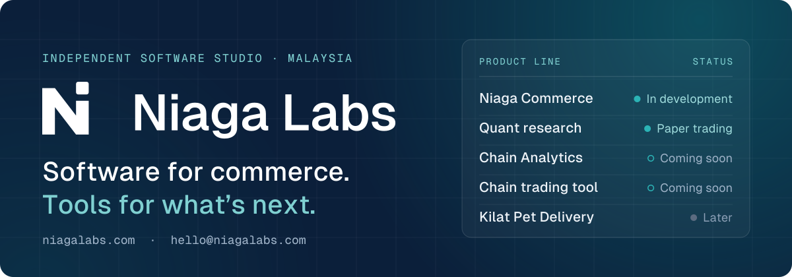
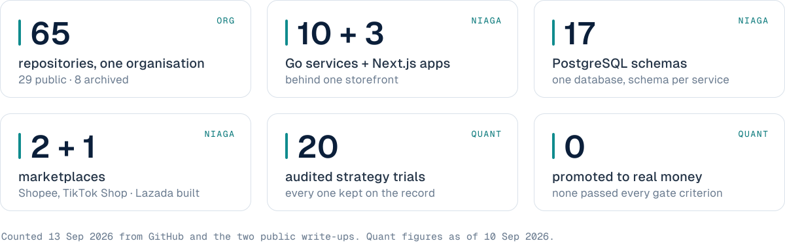
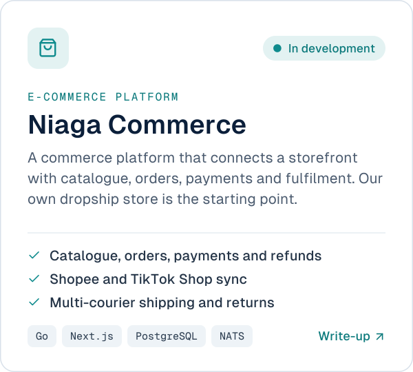
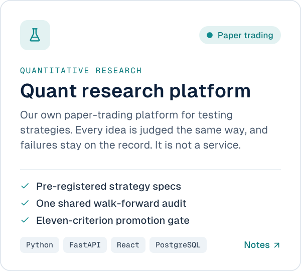
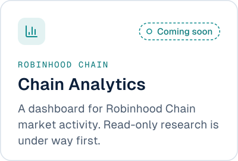
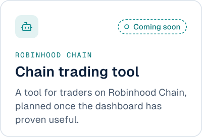
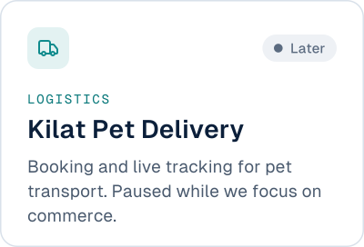
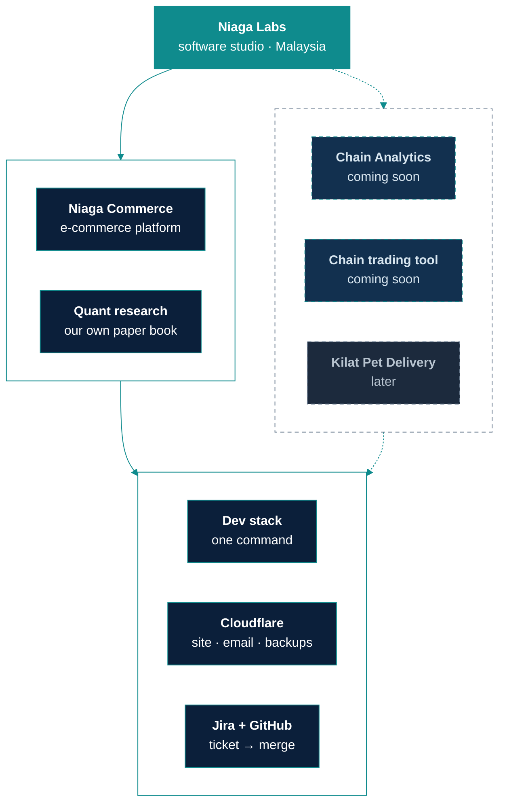
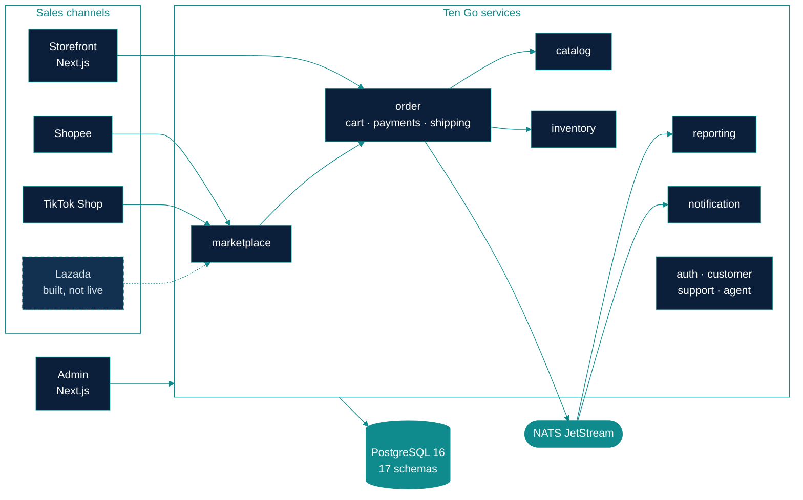
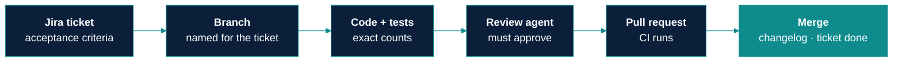

### An independent software studio in Malaysia.

We build an e-commerce platform for our own store and a research platform that tests trading ideas on paper. 
More products follow, one at a time. Everything is designed, built and run in-house.

<picture>
  <source media="(prefers-color-scheme: dark)" srcset="assets/stats-dark.svg" />
  
</picture>

<b>Where these numbers come from</b>

 

| Number | Source |
|---|---|
| 65 repositories, 29 public, 8 archived | `gh repo list niaga-labs`, 13 Sep 2026 |
| 10 Go services, 3 Next.js apps | the `niaga-labs-ecom-service-*` and `niaga-labs-ecom-frontend-*` repositories, and the [Niaga write-up](https://github.com/niaga-labs/niaga-labs-ecom-showcase) |
| 17 PostgreSQL schemas | `niaga-labs-ecom-infra-database` and the Niaga write-up |
| 2 + 1 marketplaces | Shopee and TikTok Shop sync is live-capable. Lazada is complete but proven against fixtures only (Niaga write-up) |
| 20 trials, 0 promoted | the [quant research notes](https://github.com/niaga-labs/niaga-labs-quant-showcase), section 7, as of 10 Sep 2026 |

## What we build

<a href="https://github.com/niaga-labs/niaga-labs-ecom-showcase"><picture><source media="(prefers-color-scheme: dark)" srcset="assets/card-commerce-dark.svg" /></picture></a>
<a href="https://github.com/niaga-labs/niaga-labs-quant-showcase"><picture><source media="(prefers-color-scheme: dark)" srcset="assets/card-quant-dark.svg" /></picture></a>

Click a card for its public write-up; the code itself stays private. The quant platform trades our own paper
book only. It is not a signal, subscription or trading service, and nothing on this page is investment advice.

### What comes next

<picture><source media="(prefers-color-scheme: dark)" srcset="assets/card-chain-analytics-dark.svg" /></picture>
<picture><source media="(prefers-color-scheme: dark)" srcset="assets/card-chain-tool-dark.svg" /></picture>
<a href="https://github.com/orgs/niaga-labs/repositories?q=niaga-labs-pet&type=public"><picture><source media="(prefers-color-scheme: dark)" srcset="assets/card-kilat-dark.svg" /></picture></a>

Planned products, shown so you know where the studio is heading. No dates or prices yet.

## How it fits together

## Inside Niaga Commerce

Ten Go services behind a Next.js storefront and admin, one PostgreSQL database with a schema per service, and
NATS JetStream for events. Built from 2023 to 2026 for a single online store, then generalised.

The full story is in the [Niaga write-up](https://github.com/niaga-labs/niaga-labs-ecom-showcase) and the
[platform document](https://github.com/niaga-labs/.github/blob/main/niaga-platform.md): every service, the order
flow, the database design and the patterns behind them.

## How we work

- **Ticket first.** Every change starts from a Jira ticket and lands on its own branch, named for it.
- **Green before it ships.** Tests pass before a commit, and the exact counts go into the pull request.
- **Reviewed, then merged.** A review agent checks the diff against the ticket's acceptance criteria and has to
  approve it before the merge.
- **Written down as it happens.** A changelog entry for every change and a lessons log for every surprise, so the
  reasoning is still there six months later.
- **Safe by default.** Hooks keep secrets out of every repository. Database backups are encrypted and
  restore-tested.
- **Built by a person, with AI in the toolkit.** ChatGPT and Claude help explore, build and review. A human sets
  the direction and owns every decision.

## Stack

<picture>
  <source media="(prefers-color-scheme: dark)" srcset="https://skillicons.dev/icons?i=go,ts,nextjs,react,tailwind,python,fastapi,postgres,redis,kafka,docker,nginx,cloudflare,githubactions,swift&theme=dark&perline=15" />
  
</picture>

| Layer | What we use |
|---|---|
| Services | Go 1.25 microservices · Python 3.12 with FastAPI |
| Front ends | Next.js · React · TypeScript · Tailwind · SwiftUI for the Kilat iOS apps |
| Data | PostgreSQL 16 with PostGIS · Redis · MinIO · Meilisearch |
| Messaging | NATS JetStream for Niaga · Kafka for Kilat |
| Platform | Docker Compose · nginx · GitHub Actions · Cloudflare Pages, DNS, Email Routing and R2 |

## Where the code lives

Every repository is named `niaga-labs-<product>-<name>`.

| Product code | Product | Repositories | Start here |
|---|---|---|---|
| `ecom` | Niaga Commerce | 21, 3 public | [write-up](https://github.com/niaga-labs/niaga-labs-ecom-showcase) · [`lib-common`](https://github.com/niaga-labs/niaga-labs-ecom-lib-common) · [`lib-ui`](https://github.com/niaga-labs/niaga-labs-ecom-lib-ui) |
| `quant` | Quant research platform | 2, 1 public | [research notes](https://github.com/niaga-labs/niaga-labs-quant-showcase) |
| `chain` | Chain Analytics and the Chain trading tool | 1, private | coming soon |
| `pet` | Kilat Pet Delivery | 30, 24 public | [public repositories](https://github.com/orgs/niaga-labs/repositories?q=niaga-labs-pet&type=public) |
| `platform` · `hq` | Shared dev stack · company site | 2, private | [niagalabs.com](https://niagalabs.com) |
| `crm` | Early CRM scaffolds | 8, archived | |

## Who

**Muhammad Luqman**, founder and engineer. Designs, builds and runs everything here. 
[GitHub](https://github.com/MuhammadLuqman-99) · [LinkedIn](https://www.linkedin.com/in/muhammad-luqman-b894a4337) · [hello@niagalabs.com](mailto:hello@niagalabs.com)

 

 
<picture>
  <source media="(prefers-color-scheme: dark)" srcset="assets/wordmark-white.svg" />
  
</picture>

© 2026 Niaga Labs · Malaysia · <a href="https://niagalabs.com">niagalabs.com</a>

