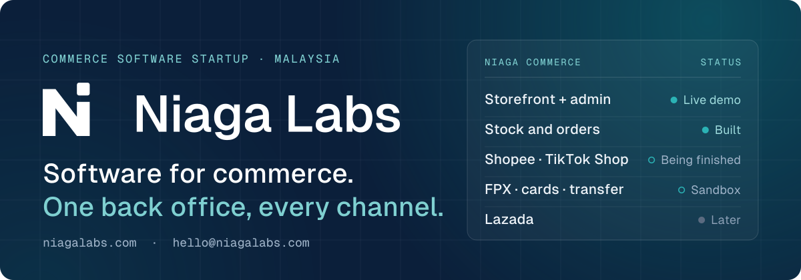
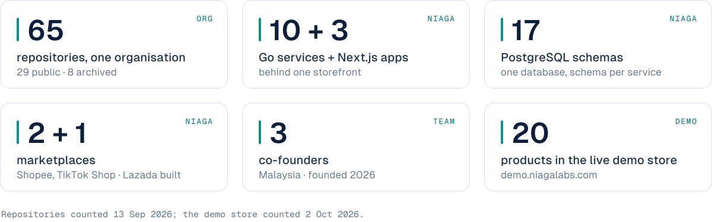
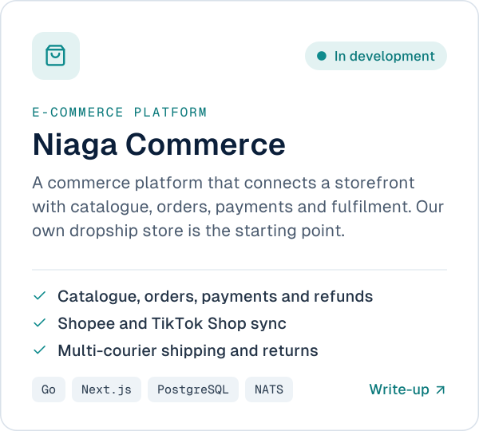
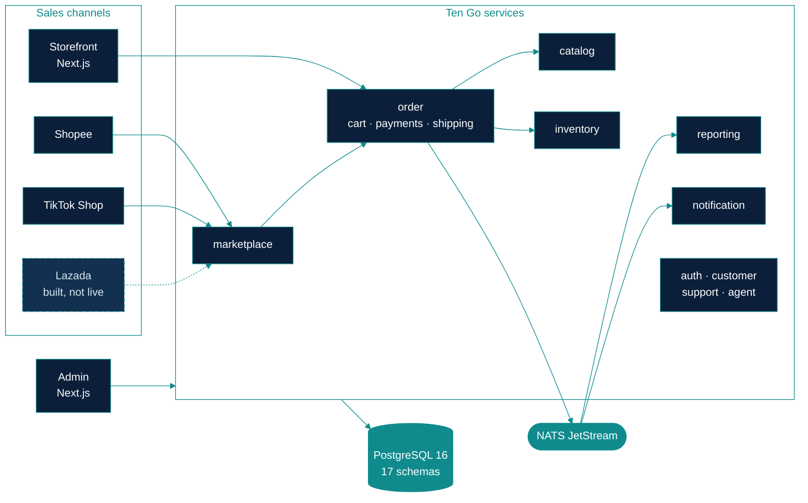
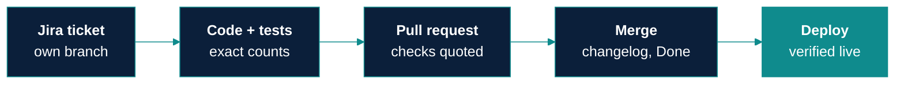

### A Malaysian startup building software for commerce.

We build **Niaga Commerce**: one back office for a seller's own online store, Shopee and TikTok Shop. 
Products, stock, orders, payments and shipping in one place. One product, built and run in-house.

<picture>
  <source media="(prefers-color-scheme: dark)" srcset="assets/stats-dark.svg" />
  
</picture>

<b>Where these numbers come from</b>

 

| Number | Source |
|---|---|
| 65 repositories, 29 public, 8 archived | `gh repo list niaga-labs`, 13 Sep 2026 |
| 10 Go services, 3 Next.js apps | the `niaga-labs-ecom-service-*` and `niaga-labs-ecom-frontend-*` repositories, and the [Niaga write-up](https://github.com/niaga-labs/niaga-labs-ecom-showcase) |
| 17 PostgreSQL schemas | `niaga-labs-ecom-infra-database` and the Niaga write-up |
| 2 + 1 marketplaces | Shopee and TikTok Shop connections are being finished. Lazada is complete but proven against fixtures only (Niaga write-up) |
| 3 co-founders | [niagalabs.com/about](https://niagalabs.com/about/) |
| 20 demo products | the live demo store, counted 2 Oct 2026 |

## What we build

<a href="https://github.com/niaga-labs/niaga-labs-ecom-showcase"><picture><source media="(prefers-color-scheme: dark)" srcset="assets/card-commerce-dark.svg" /></picture></a>

Niaga Commerce is our one product. A seller who lists on Shopee, on TikTok Shop and on their own site is running
three catalogues, three stock counts and three order lists; Niaga puts them in one place, so the same item is not
sold twice. Our own store runs on it first. See it running at **[demo.niagalabs.com](https://demo.niagalabs.com)**.

Click the card for the public write-up; the code itself stays private.

## Inside Niaga Commerce

Ten Go services behind a Next.js storefront and admin, one PostgreSQL database with a schema per service, and
NATS JetStream for events. Built from 2023 to 2026 for a single online store, then generalised.

```mermaid
%%{init: {"theme": "base", "themeVariables": {"primaryColor": "#0B1F3A", "primaryTextColor": "#FFFFFF", "nodeTextColor": "#FFFFFF", "primaryBorderColor": "#0F8B8D", "lineColor": "#0F8B8D", "titleColor": "#0F8B8D", "textColor": "#0F8B8D"}}}%%
flowchart LR
    subgraph CH["Sales channels"]
        direction TB
        SF["Storefront<br/>Next.js"]
        SH["Shopee"]
        TT["TikTok Shop"]
        LZ["Lazada<br/>built, not live"]
    end

    subgraph CORE["Ten Go services"]
        direction TB
        MKT["marketplace"]
        ORD["order<br/>cart · payments · shipping"]
        CAT["catalog"]
        INV["inventory"]
        RPT["reporting"]
        NOTIF["notification"]
        REST["auth · customer<br/>support · agent"]
    end

    ADM["Admin<br/>Next.js"]
    BUS(["NATS JetStream"])
    PG[("PostgreSQL 16<br/>17 schemas")]

    SF --> ORD
    SH --> MKT
    TT --> MKT
    LZ -.-> MKT
    MKT --> ORD
    ORD --> INV
    ORD --> CAT
    ORD --> BUS
    BUS --> NOTIF
    BUS --> RPT
    ADM --> CORE
    CORE --> PG

    classDef soon fill:#12304F,stroke:#0F8B8D,stroke-dasharray:5 4,color:#D8E6F0
    classDef infra fill:#0F8B8D,stroke:#0F8B8D,color:#FFFFFF
    class LZ soon
    class BUS,PG infra
    style CH fill:none,stroke:#0F8B8D
    style CORE fill:none,stroke:#0F8B8D
```

The full story is in the [Niaga write-up](https://github.com/niaga-labs/niaga-labs-ecom-showcase) and the
[platform document](https://github.com/niaga-labs/.github/blob/main/niaga-platform.md): every service, the order
flow, the database design and the patterns behind them.

## How we work

```mermaid
%%{init: {"theme": "base", "themeVariables": {"primaryColor": "#0B1F3A", "primaryTextColor": "#FFFFFF", "nodeTextColor": "#FFFFFF", "primaryBorderColor": "#0F8B8D", "lineColor": "#0F8B8D"}}}%%
flowchart LR
    T["<b>Jira ticket</b><br/>own branch"] --> C["<b>Code + tests</b><br/>exact counts"]
    C --> P["<b>Pull request</b><br/>checks quoted"]
    P --> M["<b>Merge</b><br/>changelog, Done"]
    M --> D["<b>Deploy</b><br/>verified live"]

    classDef done fill:#0F8B8D,stroke:#0F8B8D,color:#FFFFFF
    class D done
```

- **Ticket first.** Every change starts from a Jira ticket and lands on its own branch, named for it.
- **Green before it ships.** The repository's own checks pass before a merge, and the exact counts go into the
  pull request.
- **Checked live.** After a deploy we test the real site from the outside, not only the build.
- **Written down as it happens.** A changelog entry for every change and a lessons log for every surprise, so the
  reasoning is still there six months later.
- **Safe by default.** Hooks keep secrets out of every repository. Database backups are encrypted and
  restore-tested.
- **People decide, AI helps.** ChatGPT, Claude and Codex help explore, build and review. The founders set the
  direction and own every decision.

## Stack

<picture>
  <source media="(prefers-color-scheme: dark)" srcset="https://skillicons.dev/icons?i=go,ts,nextjs,react,tailwind,postgres,redis,docker,nginx,cloudflare&theme=dark&perline=10" />
  
</picture>

| Layer | What we use |
|---|---|
| Services | Go 1.25 microservices |
| Front ends | Next.js · React · TypeScript · Tailwind |
| Data | PostgreSQL 16 · Redis · MinIO · Meilisearch |
| Messaging | NATS JetStream |
| Platform | Docker Compose · nginx · Cloudflare Pages, DNS, Tunnel and R2 |

## Where the code lives

Every repository is named `niaga-labs-<product>-<name>`. Niaga Commerce is `ecom`.

| Product code | What | Start here |
|---|---|---|
| `ecom` | Niaga Commerce | [write-up](https://github.com/niaga-labs/niaga-labs-ecom-showcase) · [`lib-common`](https://github.com/niaga-labs/niaga-labs-ecom-lib-common) · [`lib-ui`](https://github.com/niaga-labs/niaga-labs-ecom-lib-ui) |
| `platform` · `hq` | Shared dev stack · company site | [niagalabs.com](https://niagalabs.com) |

Other repositories here are earlier experiments, paused or archived. They are not products we offer.

## Who

Three co-founders in Selangor, Malaysia.

| | |
|---|---|
| **Muhammad Luqman** · Founder & CEO | product, platform code and the company · [GitHub](https://github.com/MuhammadLuqman-99) · [LinkedIn](https://www.linkedin.com/in/muhammad-luqman-b894a4337) |
| **Amirul Afanndy** · Co-founder, DevOps | the servers, the release pipeline and the monitoring |
| **Wildan W.** · Co-founder, Business & Ops | onboarding sellers, partnerships and operations |

More at [niagalabs.com/about](https://niagalabs.com/about/) · [hello@niagalabs.com](mailto:hello@niagalabs.com)

 
<picture>
  <source media="(prefers-color-scheme: dark)" srcset="assets/wordmark-white.svg" />
  
</picture>

© 2026 Niaga Labs · a startup in Malaysia · <a href="https://niagalabs.com">niagalabs.com</a>

